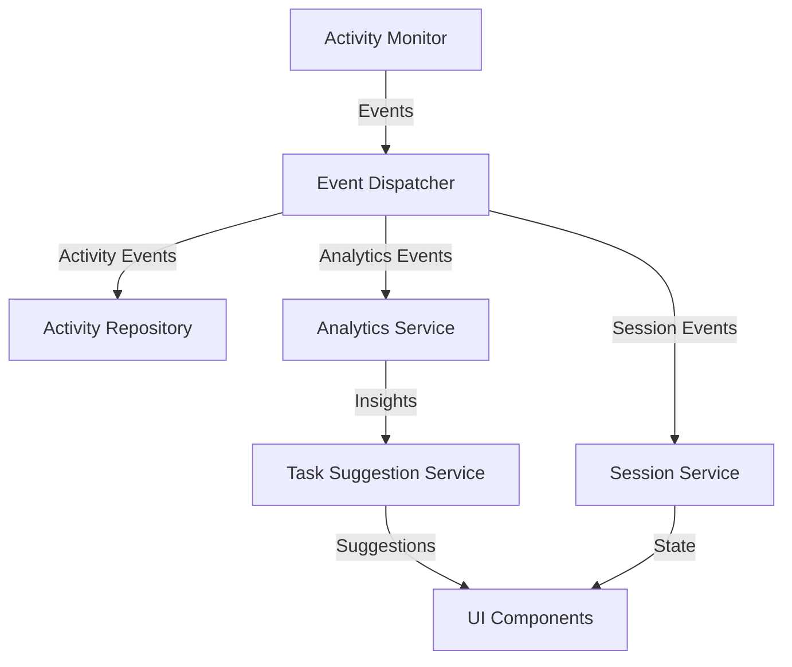
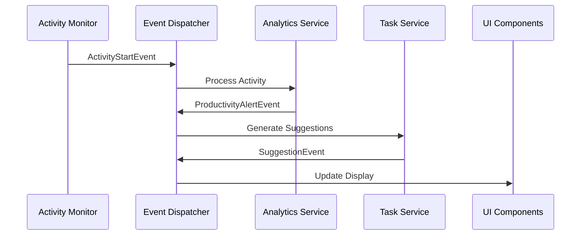

# AI Work Assistant Architecture

## Overview

The AI Work Assistant is designed as a modular, event-driven desktop application that helps users track and improve their productivity. The system follows clean architecture principles with clear separation of concerns and dependency inversion.

## Core Principles

1. **Privacy-First Design**
   - All data stored locally
   - No external dependencies
   - Complete user control over data

2. **Modularity**
   - Loosely coupled components
   - Event-driven communication
   - Dependency injection

3. **Extensibility**
   - Plugin architecture
   - Custom event types
   - Configurable ML models

## System Components

### 1. Core Layer

#### 1.1 Entities
- `Activity`: Represents a user activity
- `Event`: Base class for system events
- `Configuration`: System configuration

#### 1.2 Interfaces
- `ActivityRepository`: Data access interface
- `EventHandler`: Event handling interface
- `MLModel`: Machine learning model interface

#### 1.3 Services
- `ActivityMonitor`: Tracks user activities
- `AnalyticsService`: Analyzes productivity patterns
- `SessionService`: Manages work sessions
- `TaskSuggestionService`: Generates task suggestions

### 2. Infrastructure Layer

#### 2.1 Data Storage
- Local JSON storage
- File-based session management
- Encrypted data at rest

#### 2.2 OS Integration
- Window tracking
- Process monitoring
- System tray integration

#### 2.3 Machine Learning
- Activity categorization
- Pattern recognition
- Continuous learning

### 3. Application Layer

#### 3.1 Event System
- Event dispatcher
- Event handlers
- Event types:
  - ActivityStartEvent
  - ActivityEndEvent
  - ProductivityAlertEvent
  - SessionEvent
  - BehaviorPatternEvent

#### 3.2 Use Cases
- Activity tracking
- Session management
- Analytics generation
- Task suggestions

### 4. Presentation Layer

#### 4.1 UI Components
- System tray application
- Analytics dashboard
- Settings dialog
- Notification system

#### 4.2 Data Visualization
- Productivity charts
- Activity patterns
- Time heatmaps

## Data Flow



## Event Flow



## Directory Structure

```
ai_work_assistant/
├── src/
│   ├── core/              # Core business logic
│   │   ├── entities/      # Business objects
│   │   ├── interfaces/    # Abstract interfaces
│   │   └── services/      # Core services
│   ├── infrastructure/    # External implementations
│   │   ├── database/      # Data storage
│   │   ├── os/           # OS integration
│   │   └── ml/           # Machine learning
│   ├── application/       # Application services
│   │   ├── handlers/      # Use case handlers
│   │   └── interfaces/    # Application interfaces
│   └── presentation/      # UI layer
│       ├── ui/           # UI components
│       └── views/        # View models
├── tests/                # Test suites
│   ├── unit/
│   ├── integration/
│   └── e2e/
└── docs/                # Documentation
```

## Dependencies

### Core Dependencies
- PyQt6: UI framework
- NumPy: Numerical computations
- Pandas: Data analysis
- scikit-learn: Machine learning

### Development Dependencies
- pytest: Testing framework
- black: Code formatting
- mypy: Type checking
- flake8: Linting

## Security

### 1. Data Security
- Local storage encryption
- Secure memory handling
- Access control

### 2. Privacy
- No data collection
- No external communication
- User data control

## Performance

### 1. Requirements
- Response time < 100ms
- UI updates < 500ms
- Memory usage < 200MB
- CPU usage < 50%

### 2. Optimizations
- Event batching
- Lazy loading
- Data caching
- Background processing

## Testing Strategy

### 1. Unit Tests
- Component isolation
- Mocked dependencies
- Coverage > 90%

### 2. Integration Tests
- Component interaction
- Event propagation
- Data flow

### 3. End-to-End Tests
- Complete workflows
- UI interaction
- System stability

### 4. Performance Tests
- Response times
- Resource usage
- Concurrency
- Load testing

## Error Handling

### 1. Principles
- Graceful degradation
- User feedback
- Error recovery
- Logging

### 2. Implementation
- Exception handling
- Error events
- Recovery strategies
- Monitoring

## Configuration

### 1. Settings
- User preferences
- System settings
- ML parameters
- UI customization

### 2. Storage
- JSON format
- Local files
- Version control
- Migration support

## Deployment

### 1. Build Process
- Dependency management
- Asset bundling
- Version control
- Testing pipeline

### 2. Distribution
- Platform packages
- Auto-updates
- Installation
- Uninstallation

## Maintenance

### 1. Logging
- Activity logs
- Error logs
- Performance metrics
- Debug information

### 2. Monitoring
- Resource usage
- Error rates
- Performance
- User patterns

### 3. Updates
- Version management
- Data migration
- Configuration updates
- Security patches